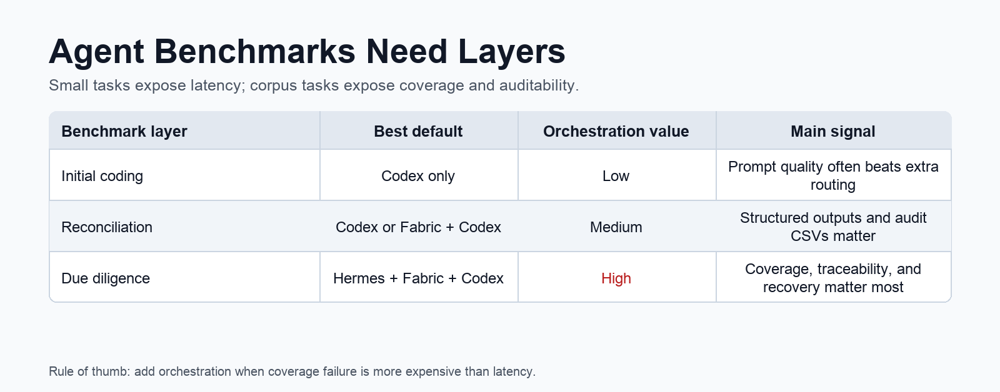
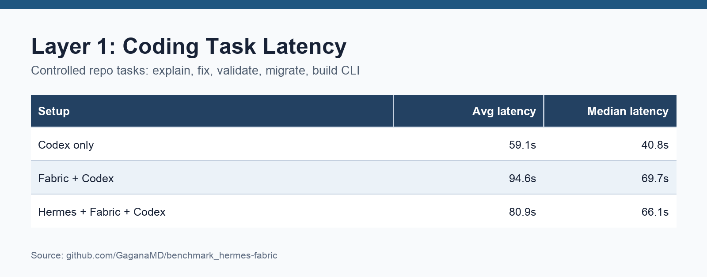
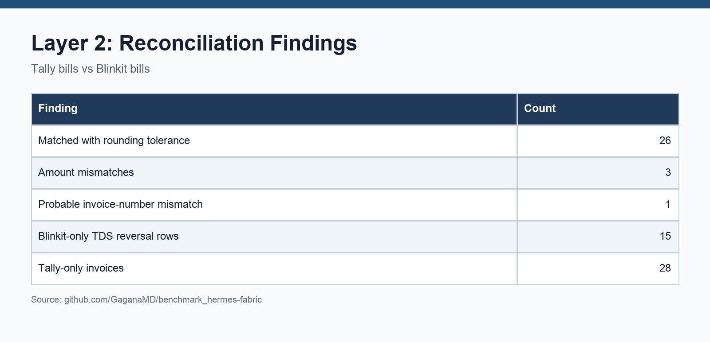
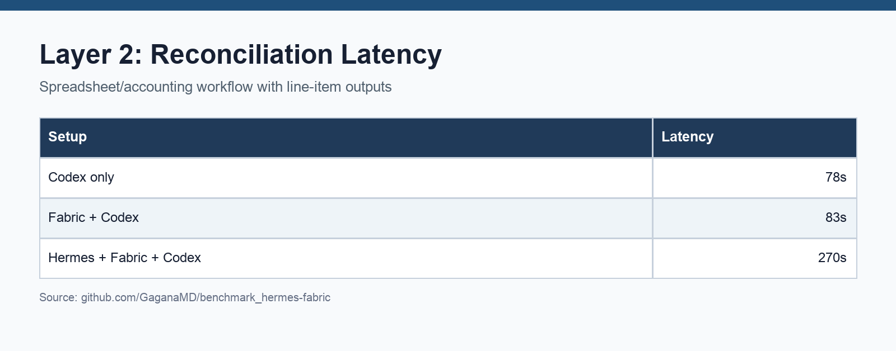
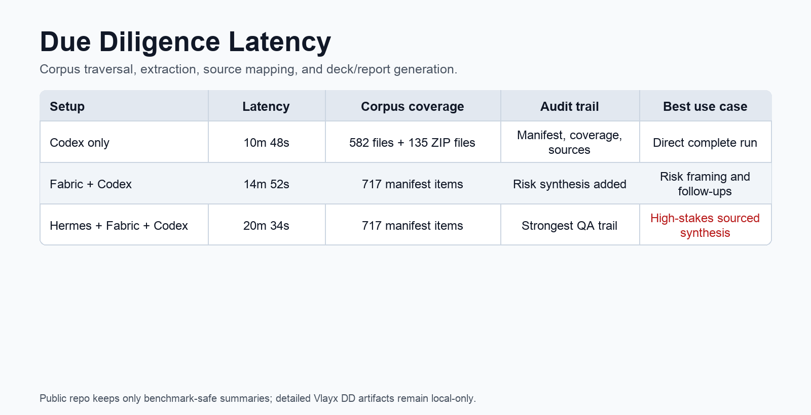
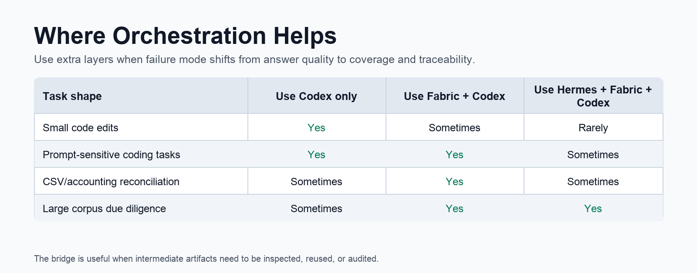

# Benchmark Hermes + Fabric

Benchmark artifacts for comparing direct Codex runs, Fabric-enhanced prompting, and Hermes + Fabric + Codex orchestration across three task layers:

1. **Initial coding benchmarks**: small repository tasks such as code explanation, bug fixing, input validation, config migration, worker reliability, and CLI creation.
2. **Reconciliation benchmark**: Tally bills vs Blinkit bills, with matching, mismatch classification, and output CSVs.
3. **Due diligence benchmark**: recursive review of a Vlayx diligence corpus, extraction coverage, source mapping, and 21-slide deck generation.

Repository: <https://github.com/GaganaMD/benchmark_hermes-fabric/>

## Why This Exists

Small coding tasks are useful, but they do not fully stress agent workflows. This repo keeps the artifacts from a broader benchmark arc:

- coding tasks test scoped implementation and verification,
- reconciliation tests tabular/accounting reasoning and line-item classification,
- due diligence tests corpus traversal, extraction coverage, auditability, and source-backed synthesis.

The main question is not only "which stack is fastest?" It is:

> At what task complexity does orchestration overhead become worth it?

## Headline Results

Latency is end-to-end agent/runtime latency, not only model inference.

## Initial Coding Benchmark

The coding benchmark compares three setups across 10 tasks:

- **Codex only**: direct task prompt.
- **Fabric + Codex**: Fabric-style prompt restructuring before Codex.
- **Hermes + Fabric + Codex**: more structured orchestration and recovery/verification behavior.

Key artifact:

- [`initial benchmarks/actual_model_outputs_table.md`](initial%20benchmarks/actual_model_outputs_table.md)

## Reconciliation Benchmark

The reconciliation task compares Tally bills against Blinkit bills and classifies matched invoices, amount mismatches, invoice-number mismatches, Tally-only invoices, and Blinkit-only/TDS reversal rows.

Key artifacts:

- [`reconcile_task/reconcile_benchmark.md`](reconcile_task/reconcile_benchmark.md)
- [`reconcile_task/reconciliation_summary.md`](reconcile_task/reconciliation_summary.md)
- [`reconcile_task/output/reconciliation_report_final.md`](reconcile_task/output/reconciliation_report_final.md)
- [`reconcile_task/output/`](reconcile_task/output/)

## Due Diligence Benchmark

The DD task required a complete PowerPoint deck by investigating every readable file in a target folder tree, mapping each claim to source files, and explicitly listing risks, inconsistencies, and gaps.

Corpus/output summary:

- 582 tree files inventoried
- 135 ZIP-contained files expanded/reviewed
- 717 total manifest items
- 0 extraction errors
- 21-slide sourced deck
- PDF exports for GitHub preview

Key public artifacts:

- [`DD/Vlayx_DD_work/output/vlayx_due_diligence_comparison.md`](DD/Vlayx_DD_work/output/vlayx_due_diligence_comparison.md)
- [`DD/Vlayx_DD_work/output/Vlayx_Due_Diligence_Report.pdf`](DD/Vlayx_DD_work/output/Vlayx_Due_Diligence_Report.pdf)
- [`DD/Vlayx_DD_work/output/Vlayx_Due_Diligence_Report.pptx`](DD/Vlayx_DD_work/output/Vlayx_Due_Diligence_Report.pptx)
- [`DD/Vlayx_DD_work/output/only codex/Vlayx_Due_Diligence_Report.pdf`](DD/Vlayx_DD_work/output/only%20codex/Vlayx_Due_Diligence_Report.pdf)
- [`DD/Vlayx_DD_work/output/codex+fabric/Vlayx_Due_Diligence_Report.pdf`](DD/Vlayx_DD_work/output/codex+fabric/Vlayx_Due_Diligence_Report.pdf)
- [`DD/Vlayx_DD_work/output/codex+fabric/fabric_risk_synthesis_latest.md`](DD/Vlayx_DD_work/output/codex+fabric/fabric_risk_synthesis_latest.md)
- [`DD/Vlayx_DD_work/output/codex+fabric+hermes/Vlayx_Due_Diligence_Report.pdf`](DD/Vlayx_DD_work/output/codex+fabric+hermes/Vlayx_Due_Diligence_Report.pdf)
- [`DD/Vlayx_DD_work/output/codex+fabric+hermes/fabric_risk_synthesis_latest.md`](DD/Vlayx_DD_work/output/codex+fabric+hermes/fabric_risk_synthesis_latest.md)

The DD source corpus, extracted text, manifests, coverage files, source registers, preview HTML, and image-review internals are intentionally kept local-only because they may contain client-sensitive material.

## Bridge Context

This benchmark repo is paired with the Herbric bridge repo:

- Herbric: <https://github.com/GaganaMD/herbric>

Herbric demonstrates a lightweight Fabric -> Hermes bridge: chunk input, run Fabric patterns, aggregate context, send the structured context into Hermes, and keep every intermediate artifact inspectable.

## What To Take Away

- **Prompt structure transfers**: Fabric-style role framing, constraints, output schemas, done-when checks, and verification reminders can often be distilled into direct Codex prompts.
- **Latency compounds**: extra orchestration can be expensive on small tasks.
- **Auditability matters**: for reconciliation and due diligence, intermediate artifacts and verification checks become more valuable.
- **Use orchestration selectively**: direct Codex is usually enough for scoped coding tasks; orchestration becomes more useful when coverage, source grounding, and recovery behavior matter.

## Notes

- These are local benchmark runs, not universal performance claims.
- Latency includes full agent/runtime behavior.
- Some task/setup pairs have verification caveats noted in the output tables.
- The X-thread draft markdown files are intentionally not part of the committed benchmark artifacts.
